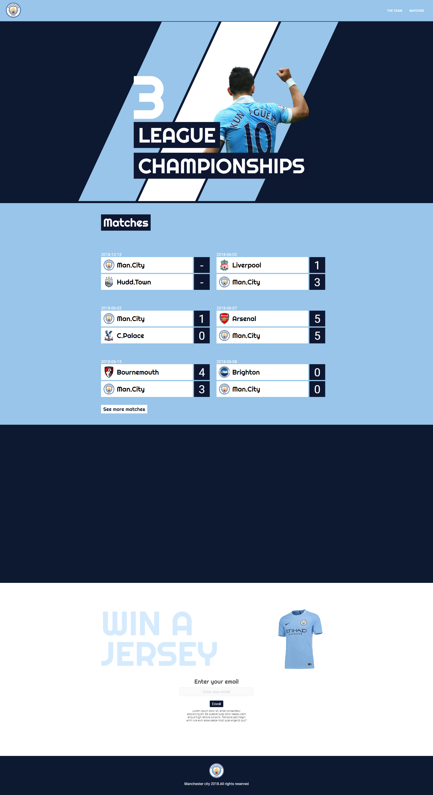
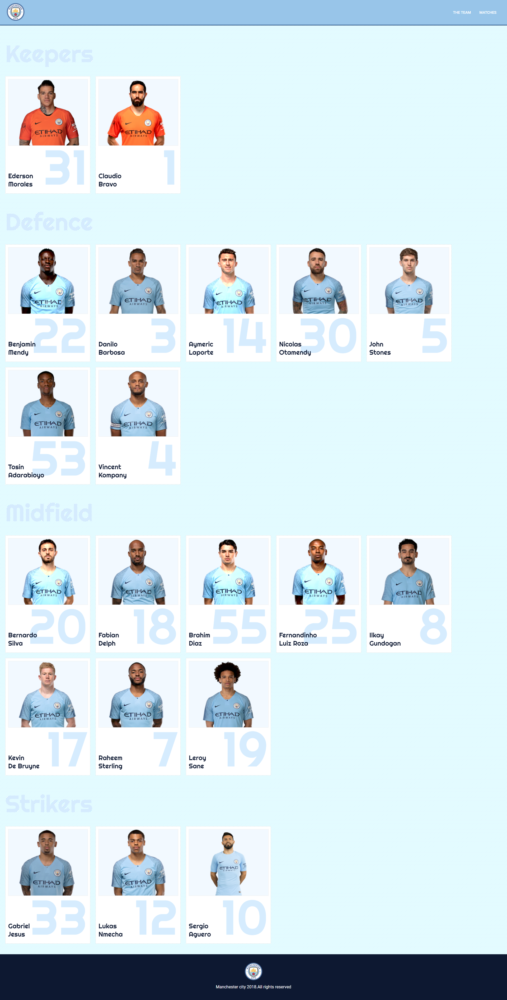
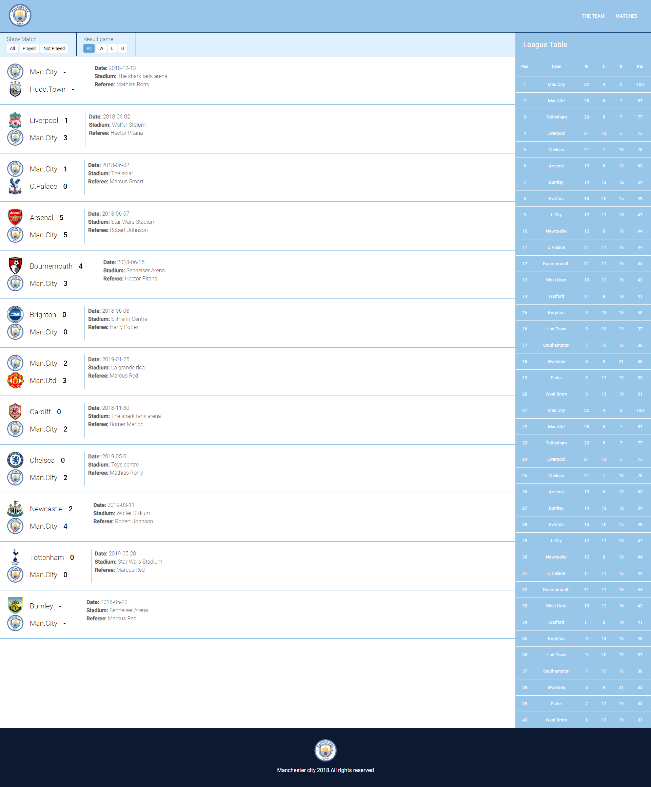
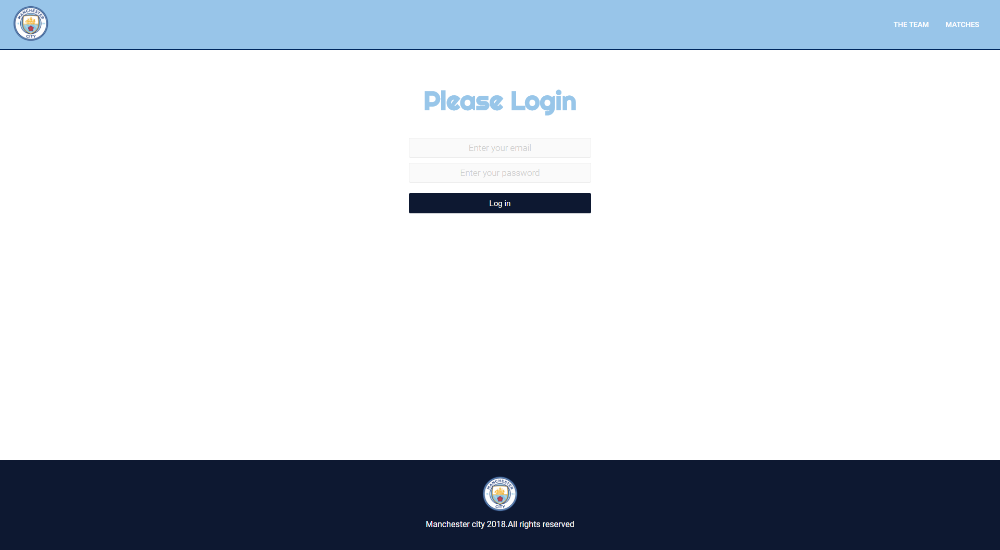
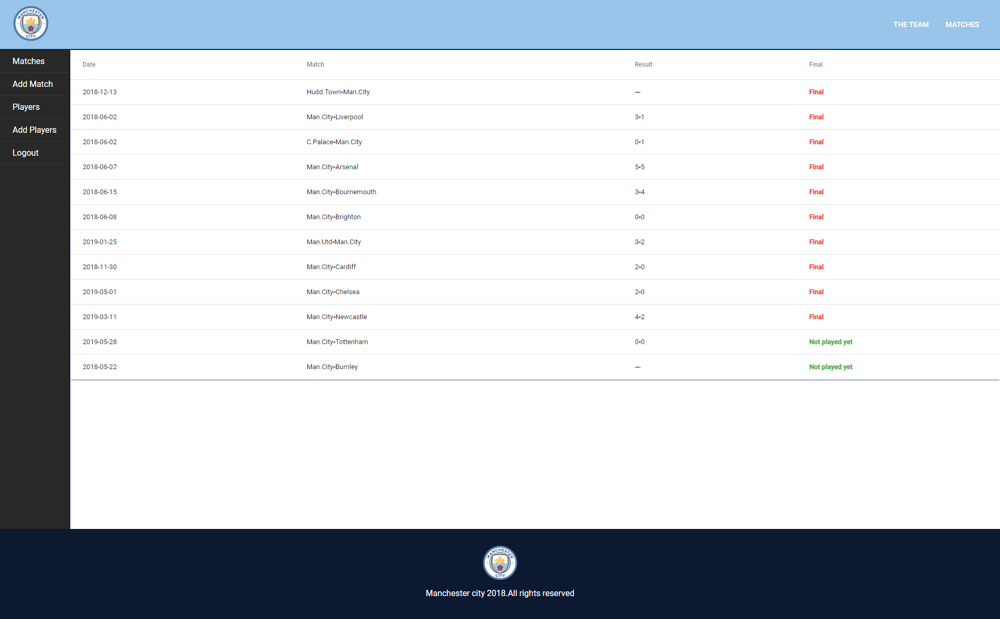

FootBall Match Web App
-----------------------

Demo  : <a href="https://m-city-df233.firebaseapp.com/">Demo</a> 
Dashboard : <a href="https://m-city-df233.firebaseapp.com/sign_in">Dashboard</a> 
userrname : francis@gmail.com  
password : password  

React based Web app with fire base database which i have created by following a tutorial  

Home Page
----------

Team Page
---------

Matches
-------

Sign_in
--------

Dashboard
---------

